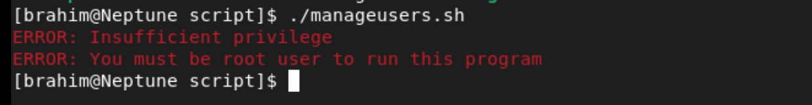
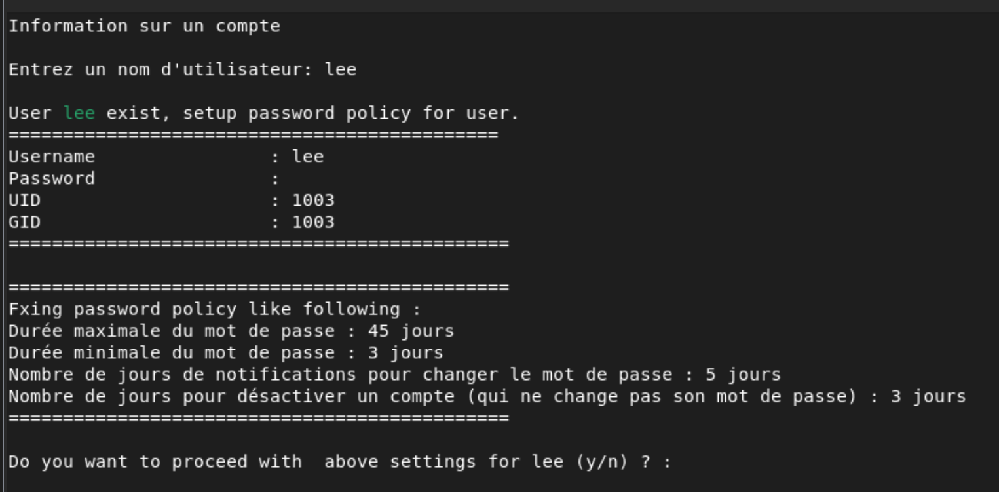
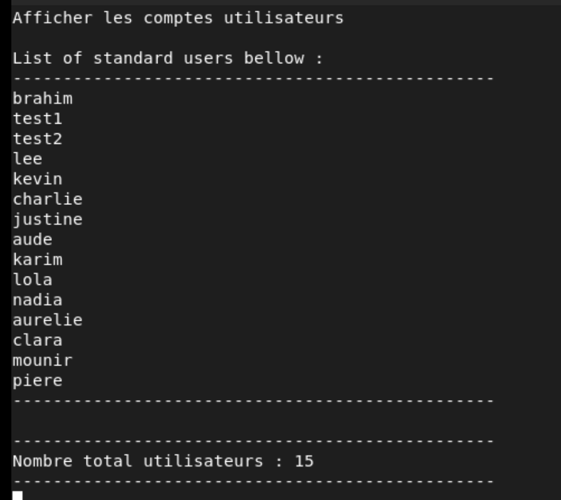

# College Ahuntsic — Scripts (Bash / Python / SQL)

Scripts developed as part of my studies at **Collège Ahuntsic** in Montreal.  
Author: **Brahim O.**

---

## Repository Structure

```
college-ahuntsic-scripts/
├── bash/
│   └── usermanager.sh      # Linux user & group management tool
├── python/
│   └── ...                 # Python script (coming soon)
└── sql/
    └── ...                 # SQL script (coming soon)
```

---

## Bash — User & Group Manager (`usermanager.sh`)

An interactive menu-driven Bash script for managing Linux users and groups.  
Must be run as **root**.

### Features

| Option | Description |
|--------|-------------|
| 1 | Display information about a user account |
| 2 | Display information about a group |
| 3 | List all standard user accounts |
| 4 | List all service accounts |
| 5 | Manage a user's password policy |
| 6 | Display locked or disabled accounts |
| 7 | Unlock, activate or change a user's password |
| Q | Quit |

### Key functions

- `getUser` — Retrieves user info via `getent`, `id`, `awk`, `du`
- `getGroup` — Retrieves group info via `getent group`, `grep`, `awk`, `cut`
- `GetUserList` — Lists standard users (UID 1000–65533) from `/etc/passwd`
- `GetSvcAccount` — Lists service accounts (UID < 999) from `/etc/passwd`
- `ManageUserPwd` — Manages password policy with `chage` and `usermod`
- `GetLockedAccount` — Detects locked/expired accounts via `passwd -S` and `chage`
- `UnlockModifyUser` — Unlocks accounts and forces password reset at next login
- `CheckRoot` — Verifies the script is executed with root privileges
- `Quit` — Exits the script cleanly

### Usage

```bash
chmod +x usermanager.sh
sudo ./usermanager.sh
```

### Syntax validation

Script syntax verified with [ShellCheck](https://www.shellcheck.net/).

---

## 📸 Screenshots

### Root privilege check


### Main menu


### Script execution — Example 1


### Script execution — Example 2


---

## Bash Script 2 — Filesystem Monitor (`monitor-filesystem.sh`)

A Bash script that monitors the root (`/`) filesystem disk usage.  
If usage exceeds a defined threshold, it sends an email alert via SMTP.  
Also logs all activity to a local log file.

### Features

- Retrieves disk usage with `df`
- Compares usage against a configurable threshold
- Sends a **WARNING** email if threshold is exceeded
- Sends an **INFO** email if usage is below threshold
- Logs all activity with timestamps and hostname
- Credentials stored securely in `.env` file — never hardcoded

### Configuration

```bash
# Copy the credentials template
cp .env.example .env

# Edit .env with your SMTP settings
nano .env
```

### Threshold

```bash
THRESHOLD=10  # Alert if disk usage exceeds 10%
```

Modify this value directly in the script to adjust the alert level.

### Usage

```bash
chmod +x monitor-filesystem.sh
sudo ./monitor-filesystem.sh
```

### Security

| File | Purpose |
|------|---------|
| `.env` | Your real credentials — **never commit this** |
| `.env.example` | Template to share safely on GitHub |
| `.gitignore` | Ensures `.env` and logs are never pushed |

---

## Python — (Coming soon)

---

## MySQL — (Coming soon)

---

## Notes

- Developed in **February 2023** as part of a Linux administration course
- Tested on **Alma / Debian** based systems
- Color-coded output for improved readability (green / blue / red)
