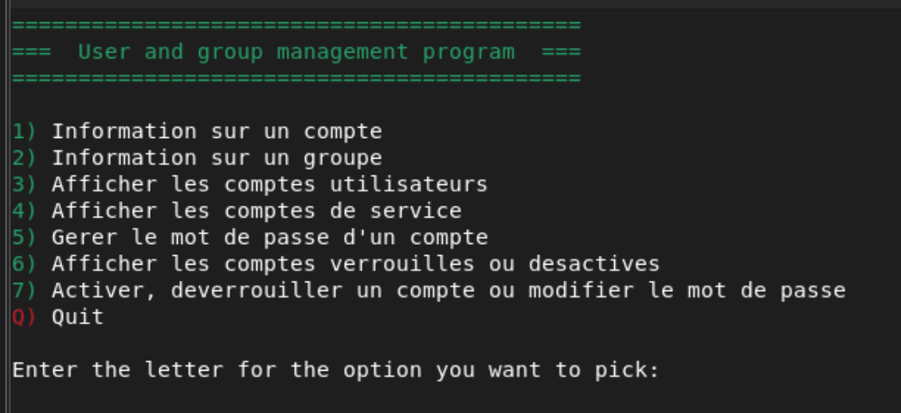

# College Ahuntsic — Scripts (Bash / Python / SQL)

Scripts developed as part of my studies at **Collège Ahuntsic** in Montreal.  
Author: **Brahim O.**

---

## Repository Structure

```
college-ahuntsic-scripts/
├── .gitignore
├── README.md
├── bash/
│   ├── usermanager.sh              # Linux user & group management tool
│   ├── monitor-filesystem.sh       # Disk usage monitoring & email alerts (Bash)
│   ├── .env.example                # Credentials template (copy to .env)
│   └── images/
│       ├── runas-root.png
│       ├── usermanager-menu.png
│       ├── usermanager-run1.png
│       └── usermanager-run2.png
├── python/
│   ├── monitor-filesystem.py       # Disk usage monitoring & email alerts (Python)
│   ├── .env.example                # Credentials template (copy to .env)
│   └── requirements.txt
└── sql/
    └── ...                         # SQL script (coming soon)
```

---

## Bash Script 1 — User & Group Manager (`usermanager.sh`)

An interactive menu-driven Bash script for managing Linux users and groups.  
Must be run as **root**.

### Features

| Option | Description |
|--------|-------------|
| 1 | Display information about a user account |
| 2 | Display information about a group |
| 3 | List all standard user accounts |
| 4 | List all service accounts |
| 5 | Manage a user's password policy |
| 6 | Display locked or disabled accounts |
| 7 | Unlock, activate or change a user's password |
| Q | Quit |

### Key functions

- `getUser` — Retrieves user info via `getent`, `id`, `awk`, `du`
- `getGroup` — Retrieves group info via `getent group`, `grep`, `awk`, `cut`
- `GetUserList` — Lists standard users (UID 1000–65533) from `/etc/passwd`
- `GetSvcAccount` — Lists service accounts (UID < 999) from `/etc/passwd`
- `ManageUserPwd` — Manages password policy with `chage` and `usermod`
- `GetLockedAccount` — Detects locked/expired accounts via `passwd -S` and `chage`
- `UnlockModifyUser` — Unlocks accounts and forces password reset at next login
- `CheckRoot` — Verifies the script is executed with root privileges
- `Quit` — Exits the script cleanly

### Usage

```bash
chmod +x usermanager.sh
sudo ./usermanager.sh
```

### Syntax validation

Script syntax verified with [ShellCheck](https://www.shellcheck.net/).

---

## Screenshots — User & Group Manager

### Root privilege check


### Main menu


### Script execution — Example 1


### Script execution — Example 2


---

## Bash Script 2 — Filesystem Monitor (`monitor-filesystem.sh`)

A Bash script that monitors the root (`/`) filesystem disk usage on AlmaLinux.  
Sends a **WARNING** email if usage exceeds the threshold, an **INFO** email otherwise.  
All activity is logged to a local log file.

### Features

- Retrieves disk usage with `df`
- Compares usage against a configurable threshold
- Sends a **WARNING** email if threshold is exceeded
- Sends an **INFO** email if usage is below threshold
- Logs all activity with timestamps and hostname
- Credentials stored securely in `.env` — never hardcoded

### Configuration

```bash
cp .env.example .env
nano .env
```

### Usage

```bash
chmod +x monitor-filesystem.sh
sudo ./monitor-filesystem.sh
```

### Security

| File | Purpose |
|------|---------|
| `.env` | Your real credentials — **never commit this** |
| `.env.example` | Template to share safely on GitHub |
| `.gitignore` | Ensures `.env` and logs are never pushed |

---

## Python — Filesystem Monitor (`monitor-filesystem.py`)

Python version of the filesystem monitor.  
Same logic as the Bash version — checks disk usage, sends email alert via SMTP.

### Features

- Interactive menu (Check / Quit)
- Sends **WARNING** email if threshold exceeded
- Sends **INFO** email if usage is within limits
- Detailed disk info (Total / Used / Free in GiB)
- Credentials loaded from `.env` via `python-dotenv`
- Compatible with **Python 3.9+**

### Installation

```bash
pip install -r requirements.txt
```

### Configuration

```bash
cp .env.example .env
nano .env
```

### Usage

```bash
python3 monitor-filesystem.py
```

### Security

| File | Purpose |
|------|---------|
| `.env` | Your real credentials — **never commit this** |
| `.env.example` | Template to share safely on GitHub |
| `.gitignore` | Ensures `.env` and logs are never pushed |

---

## MySQL — (Coming soon)

---

## Notes

- Developed in **February 2023** as part of a Linux administration course
- Bash scripts tested on **AlmaLinux / RHEL** based systems
- Python script tested on **Python 3.9.14**
- Script syntax verified with [ShellCheck](https://www.shellcheck.net/)
- Credentials always managed via `.env` files — never hardcoded
